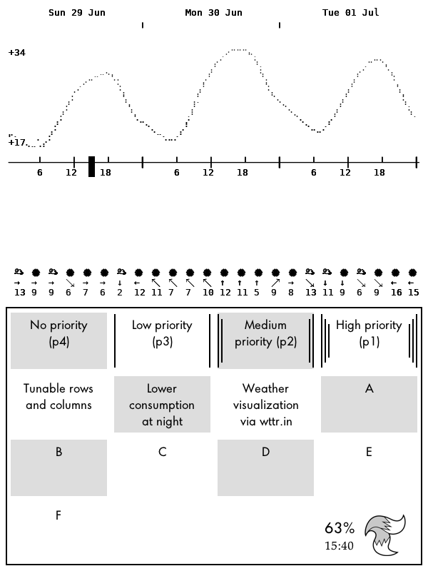

# Kindle Clock

This turns a Kindle Paperwhite into a pretty dashboard

Forked from mattzzw/kindle-clock and modified it to also hold my tasks from Todoist

Modifications from the original:

* Reimplemented nicer weather info
* Added Todoist integration to fetch tasks with the label defined in the preferences
* Made a checkerboard like pattern for the tasks
* Shows a nice image at the corner of the screen :)
* Refactored some code
* Reduced number of wakes during the night, from `NIGHT_START` to `NIGHT_END`
* Added a preferences file

These settings are specifically finetuned for my kindle so you might have to tweak some numbers for it to display properly
The preference file lets you change:

* City for the weather
* Number of rows and columns for the tasks
* Label used to mark the tasks to show on the kindle
* Screen size
* Night time interval

## What's what

* `kindle-clock.sh`: Main loop, displays weather and tasks, suspend to RAM and wakeup
* `config.xml`: KUAL config file
* `menu.json`: KUAL config file
* `get_tasks.sh`: Utility to parse the tasks
* `preferences.json`: Preference file

The script logs to `./clock.log`.

## Installation

* create directory `/mnt/us/extensions/dashboard` (you can choose another name for this last directory as long as it's in `/mnt/us/extensions/`
* copy everything to the newly created directory
* create the file `api_key.txt` containing your Todoist API key. You can find it in Settings > Integrations > Developer > API key

## Starting Clock

Open up KUAL and press 'Weather - Task dashboard'

## Manual refresh

To manually refresh the screen, simply press the power button and wait for the screen to refresh

## Stopping

Force reboot kindle by holding powerbutton until it resets

## Todo list (heh)

* [x] Parametrize the grid
* [ ] Remove the remaining magic numbers
* [x] Add a showcase image
* [ ] Find more useless processes to stop
* [x] Find a way to more efficiently parse the tasks and maybe not rely on a python script
* [x] Estimate the power consumption of different parts of the script
  * [x] Normal use
  * [x] Without enabling wifi to update time and tasks
  * [ ] Without refreshing the screen and redrawing the tasks
  * [ ] Without any of the above (night mode)
* [x] Make a decent configuration file
  * [ ] Avoid having to specify the timezone
